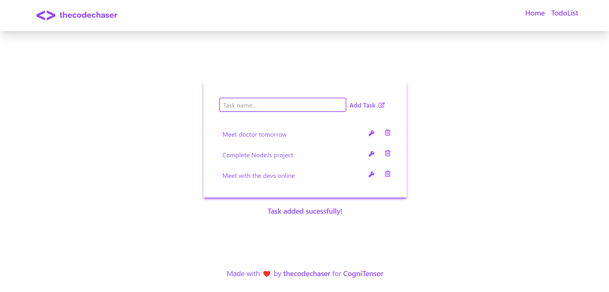

# Todo-List Frontend

> Todo-List front-end is an application for users to handle their daily tasks. Users can add, delete, and update tasks from the list. This is the front-end user interface built in React and Redux..

## Link to the backend

[Todo-List Backend](https://github.com/thecodechaser/todo-list-back-end)

## Preview:

### Home Page


### Todo-List Page



## Built With

- HTML
- CSS
- Tailwind
- JavaScript
- REACT
- Redux
- Webpack
- Jest

## Live version

#### Coming soon!

## Getting Started

To get a local copy up and running follow these simple example steps.

### Prerequisites

- A text editor(preferably Visual Studio Code)
- Node
- Web browser

### Install

- [Git](https://git-scm.com/downloads)
- [Node](https://nodejs.org/en/download/)

### Using it Locally

- Clone the project

```bash
git clone git@github.com:thecodechaser/todo-list-front-end.git

cd todo-list-front-end
```

- Install dependencies

```bash
npm i
or
npm install
```

- To Start the development server

```bash
npm start
```

- To test the project

```bash
npm run test
```

## Visit And Open Files

[Visit Repo](https://github.com/thecodechaser/todo-list-front-end)

## Download Repo

[Download Repo](https://github.com/thecodechaser/todo-list-front-end/archive/refs/heads/dev.zip)

## Authors

👤 **Ranjeet Singh**

- GitHub: [@thecodechaser](https://github.com/thecodechaser)
- Twitter: [@thecodechaser](https://twitter.com/thecodechaser)
- LinkedIn: [thecodechaser](https://linkedin.com/in/thecodechaser)

## 🤝 Contributing

Contributions, issues, and feature requests are welcome!

Feel free to check the [issues page](https://github.com/thecodechaser/todo-list-front-end/issues).

## Show your support

Give a ⭐️ if you like this project!

## Acknowledgments

- Inspiration: [CogniTensor](https://www.cognitensor.com)

## 📝 License

This project is [MIT](./LICENSE.md) licensed.
